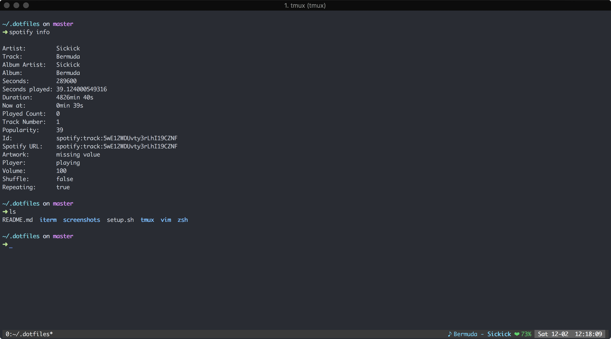

# Sohit's Dotfiles

## Table Of Contents
* [Introduction](#introduction)
* [Screenshots](#screenshots)
* [Usage](#usage)
  * [Install](#install)
  * [Uninstall](#uninstall)


## Introduction

These are dotfiles for my setup on MacOS. It includes vim (plugins, vimrc, etc), zsh, and iterm configurations.
Most of the stuff here is meant to be used on MacOS, and therefore might not work properly on other systems.

## Screenshots

**Vim**


**Iterm, Zsh, & Tmux**


## Usage

### Install

**Oh My Zsh** - https://github.com/robbyrussell/oh-my-zsh

via curl
```bash
sh -c "$(curl -fsSL https://raw.githubusercontent.com/robbyrussell/oh-my-zsh/master/tools/install.sh)"
```

via wget
```bash
sh -c "$(wget https://raw.githubusercontent.com/robbyrussell/oh-my-zsh/master/tools/install.sh -O -)"
```

**Tmux (optional)** - https://github.com/tmux/tmux

Debian/Ubuntu
```bash
sudo apt-get install tmux
```

RedHat/CentOS
```bash
yum install tmux
```

MacOS
```bash
brew install tmux
```

**Dotfiles**

```bash
git clone https://github.com/SPKB24/.dotfiles.git ~/.dotfiles 
cd ~/.dotfiles && chmod +x setup.sh && bash setup.sh 
```

... and you're done*!

### Uninstall

To uninstall my dotfiles, and restore your previous ones, copy and paste the following code into your terminal:

```bash
chmod +x uninstall.sh
bash uninstall.sh
```

*<sub>I am not liable for anything that this breaks on your computer.</sub>
